# TRIBHUVAN UNIVERSITY

## FACULTY OF HUMANITIES AND SOCIAL SCIENCES


## A Project Report On

# **Artmandu — A Virtual Art Showcase**

Submitted to  
Department of Computer Application  
National College of Computer Studies

_In partial fulfillment of the requirements for the degree of Bachelor in Computer Application_

**Submitted by:**  
Sujal Maharjan  
Roll No.: 6-2-551-51-2021

**Under the supervision of:**  
Teksan Gharti Magar

---

# Supervisor's Recommendation

I hereby recommend that the project report prepared under my supervision by **Sujal Maharjan**, entitled **“Artmandu — A Virtual Art Showcase,”** be accepted for final evaluation in partial fulfillment of the requirements for the degree of Bachelor in Computer Application.

**Signature:** ........................................  
**Supervisor:** Teksan Gharti Magar  
**Faculty Member:** Department of Computer Application  
**Institution:** National College of Computer Studies

---

# Letter of Approval

This is to certify that the project prepared by **Sujal Maharjan**, entitled **“Artmandu — A Virtual Art Showcase,”** has been evaluated in partial fulfillment of the requirements for the degree of Bachelor in Computer Application. In our opinion, the project is satisfactory in scope and quality for the required degree.

| Supervisor | HOD/Coordinator |
|---|---|
| **Signature:** ................................<br>Teksan Gharti Magar<br>Department of Computer Application<br>National College of Computer Studies | **Signature:** ................................<br>Mr. Rajan Poudel<br>Department of Computer Application<br>National College of Computer Studies |

| Internal Examiner | External Examiner |
|---|---|
| **Signature:** ................................ | **Signature:** ................................ |

---

# Acknowledgement

I would like to express my sincere gratitude to my supervisor, **Mr. Teksan Gharti Magar**, for his guidance, encouragement, and valuable suggestions throughout this project. His feedback helped shape the analysis, design, implementation, and documentation of Artmandu.

I am also thankful to our Vice Principal, **Mr. Santosh Maskey**, and to the faculty members of the Department of Computer Application at the National College of Computer Studies for their support. Finally, I appreciate the encouragement and assistance provided by my friends and family during the development of this project.

**Sujal Maharjan**

---

# Abstract

Artmandu is a web-based art gallery management system developed to help artists present their work and to help visitors discover and purchase artworks without depending on a physical gallery. The system provides a public catalogue, artwork search and classification, detailed artist and artwork information, customer registration and authentication, profile and order management, an artist portal, an administrative portal, eSewa payment handoff, content-based artwork recommendations, and AI-generated-image detection.

The main web application uses PHP, MySQLi, HTML, CSS, Bootstrap, JavaScript, and MariaDB/MySQL. A separate FastAPI service uses PyTorch and either a custom convolutional neural network or a configured Hugging Face image-classification model. During an artwork upload, the PHP application can send the primary image to this service and store the returned classification. Similar artwork suggestions are calculated from matching catalogue attributes using cosine similarity and ranking. The application can be run through Apache and MariaDB containers, while the AI detector is started as a separate service.

This report applies object-oriented analysis and design to the implemented system. The UML models describe domain concepts, responsibilities, states, and collaborations even though the main PHP implementation is procedural. The resulting model identifies users, administrators, artist profiles, artworks, art types, art media, orders, recommendations, payments, and AI detection as the principal parts of the system. Test scenarios cover authentication, role-based behavior, catalogue management, recommendation, artwork upload, payment, and order processing.

**Keywords:** online art gallery, object-oriented analysis and design, UML, recommendation system, AI-generated-image detection, eSewa

---

# Table of Contents

- [List of Abbreviations](#list-of-abbreviations)
- [List of Figures](#list-of-figures)
- [List of Tables](#list-of-tables)
- [Chapter 1: Introduction](#chapter-1-introduction)
  - [1.1 Introduction](#11-introduction)
  - [1.2 Problem Statement](#12-problem-statement)
  - [1.3 Objectives](#13-objectives)
  - [1.4 Scope and Limitations](#14-scope-and-limitations)
  - [1.5 Development Methodology](#15-development-methodology)
  - [1.6 Report Organization](#16-report-organization)
- [Chapter 2: Background Study and Literature Review](#chapter-2-background-study-and-literature-review)
  - [2.1 Background Study](#21-background-study)
  - [2.2 Literature Review](#22-literature-review)
- [Chapter 3: System Analysis and Design](#chapter-3-system-analysis-and-design)
  - [3.1 System Analysis](#31-system-analysis)
  - [3.2 System Design](#32-system-design)
  - [3.3 Algorithm Details](#33-algorithm-details)
- [Chapter 4: Implementation and Testing](#chapter-4-implementation-and-testing)
  - [4.1 Implementation](#41-implementation)
  - [4.2 Testing](#42-testing)
  - [4.3 Result Analysis](#43-result-analysis)
- [Chapter 5: Conclusion and Future Recommendations](#chapter-5-conclusion-and-future-recommendations)
- [References](#references)
- [Appendices](#appendices)

---

# List of Abbreviations

| Abbreviation | Meaning |
|---|---|
| AGMS | Art Gallery Management System |
| AI | Artificial Intelligence |
| API | Application Programming Interface |
| CNN | Convolutional Neural Network |
| CSS | Cascading Style Sheets |
| DBMS | Database Management System |
| HTML | HyperText Markup Language |
| HTTP | HyperText Transfer Protocol |
| HMAC | Hash-based Message Authentication Code |
| JSON | JavaScript Object Notation |
| OOAD | Object-Oriented Analysis and Design |
| PHP | PHP: Hypertext Preprocessor |
| RDBMS | Relational Database Management System |
| REST | Representational State Transfer |
| SQL | Structured Query Language |
| UI/UX | User Interface/User Experience |
| UML | Unified Modeling Language |

# List of Figures

| Figure | Title |
|---|---|
| Figure 1.1 | Waterfall development methodology |
| Figure 3.1 | Use-case model of Artmandu |
| Figure 3.2 | Conceptual class diagram |
| Figure 3.3 | Conceptual object diagram |
| Figure 3.4 | System and order state diagram |
| Figure 3.5 | Purchase and eSewa sequence diagram |
| Figure 3.6 | Artwork upload and AI-detection sequence diagram |
| Figure 3.7 | Purchase activity diagram |
| Figure 3.8 | Artwork submission activity diagram |
| Figure 3.9 | Refined class diagram |
| Figure 3.10 | Refined object diagram |
| Figure 3.11 | Refined order state diagram |
| Figure 3.12 | Refined request sequence diagram |
| Figure 3.13 | Refined order-review activity diagram |
| Figure 3.14 | Component diagram |
| Figure 3.15 | Deployment diagram |
| Figure A.1–A.11 | Implemented-system screenshots |

# List of Tables

| Table | Title |
|---|---|
| Table 2.1 | Review of related systems and technologies |
| Table 3.1 | Actors and responsibilities |
| Table 3.2 | Use-case descriptions |
| Table 3.3 | Non-functional requirements |
| Table 3.4 | Feasibility analysis |
| Table 3.5 | Conceptual-to-implementation mapping |
| Table 4.1 | Implementation tools and technologies |
| Table 4.2 | Implemented modules |
| Table 4.3 | Unit test cases |
| Table 4.4 | System test cases |
| Table 4.5 | Objective and result analysis |

---

# Chapter 1: Introduction

## 1.1 Introduction

Artmandu is an online art gallery designed to connect artists, art enthusiasts, and prospective buyers. A physical gallery limits participation by place, opening hours, display capacity, and operating cost. A web platform can keep artist and artwork information available continuously and can make the catalogue searchable from any supported browser.

The system has three authenticated roles. Customers manage profiles, purchase artworks, and view their orders. Artists use a dedicated portal to maintain their profiles and manage their own artworks. Administrators manage users, artist records, catalogue classifications, artworks, editable pages, and order decisions. Visitors can browse, search, view artwork details, register, and log in.

Artmandu also integrates two supporting capabilities. A content-based recommendation function compares an artwork with other catalogue items. An independent image-detection service classifies uploaded artwork images as human-created or potentially AI-generated. The purchase workflow creates an order and hands the payment request to the eSewa test environment using signed fields.

## 1.2 Problem Statement

Many artists have limited access to established galleries and therefore have difficulty presenting work to a broad audience. At the same time, potential buyers may not have a single convenient place to discover Nepali artists, compare artwork details, and initiate a purchase. Manual gallery administration also makes it harder to maintain artist records, classifications, product images, enquiries, and orders consistently.

Artmandu addresses these problems by providing a centralized catalogue and role-specific management interfaces. It reduces geographic barriers, supports independent artist participation, improves catalogue discovery, and gives administrators a consistent way to manage content and orders. The project further addresses two contemporary concerns: helping visitors discover related work and giving catalogue managers an automated signal when an uploaded image may be AI-generated.

## 1.3 Objectives

### 1.3.1 General Objective

To develop a web-based art gallery management system that enables artists to showcase artwork and enables visitors to discover and purchase it through a managed online platform.

### 1.3.2 Specific Objectives

- To provide searchable artwork, artist, art-type, and art-medium information.
- To provide secure registration, authentication, profile, and password-management facilities.
- To provide separate customer, artist, and administrator workflows.
- To allow artists and administrators to add and maintain artwork records.
- To recommend related artworks using catalogue attributes.
- To classify uploaded artwork images through an AI-detection service.
- To create purchase orders and hand signed payment requests to eSewa.
- To allow administrators to review pending orders and record approval or cancellation.

## 1.4 Scope and Limitations

### 1.4.1 Scope

- Public browsing, title search, art-type filtering, artwork details, artist information, and related-artwork recommendations.
- Customer registration, login, logout, profile update, password change, purchase submission, eSewa handoff, and personal order history.
- Artist login, dashboard, profile update, and ownership-restricted artwork creation, editing, listing, and deletion.
- Administrator authentication and management of users, artists, art types, art media, artworks, editable pages, and orders.
- AI-image classification through a FastAPI service during primary-image upload.
- MariaDB/MySQL persistence and local/containerized deployment of the PHP application.

### 1.4.2 Limitations

- Search is title-based, and browsing filters primarily by art type; it is not a full faceted-search engine.
- Recommendations compare catalogue attributes and do not learn from ratings, purchases, or long-term user behavior.
- The AI result is an advisory classification, not proof of authorship or authenticity.
- The CNN service is not included in the current Docker Compose stack and must be started separately.
- An order is stored before eSewa payment, while payment completion is not persisted in `tblorder`; administrators review order status independently.
- Orders are associated with logged-in customers by matching email addresses rather than by a user foreign key.
- Several logical database relationships are used by PHP joins but are not enforced through foreign-key constraints.
- The system uses eSewa test configuration and localhost callback URLs and therefore requires production configuration before public deployment.

## 1.5 Development Methodology

The project follows a Waterfall lifecycle because the academic deliverables and main system requirements are defined in advance. Object-oriented analysis and design is applied during the analysis and design phases using UML 2.5.1 concepts [1]. The UML artifacts are conceptual models reverse-engineered from the implemented application; they do not claim that every modeled responsibility exists as a declared PHP class.


```mermaid
flowchart LR
    A[Requirements] --> B[OO Analysis]
    B --> C[UML and System Design]
    C --> D[Implementation]
    D --> E[Testing]
    E --> F[Deployment]
    F --> G[Maintenance]
```

**Figure 1.1: Waterfall development methodology**

1. **Requirements:** Identify actors, functional behavior, quality requirements, constraints, and external services.
2. **OO analysis:** Discover the main domain objects, their relationships, states, and business processes.
3. **Design:** Refine conceptual objects into boundary, control, service, persistence, component, and deployment responsibilities.
4. **Implementation:** Develop the procedural PHP pages, SQL schema, browser interface, recommendation functions, payment handoff, and Python detection service.
5. **Testing:** Verify individual functions and complete role-based workflows.
6. **Deployment and maintenance:** Run the web and database services, start the detector separately when needed, monitor failures, and correct defects.

## 1.6 Report Organization

Chapter 1 presents the project problem, objectives, boundaries, and methodology. Chapter 2 explains the relevant concepts and reviews related technologies and studies. Chapter 3 specifies the requirements and presents object, dynamic, process, component, and deployment models. Chapter 4 describes the implementation and testing approach and evaluates the results against the objectives. Chapter 5 concludes the report and identifies future improvements.

---

# Chapter 2: Background Study and Literature Review

## 2.1 Background Study

### 2.1.1 Online Art Galleries

An online art gallery stores digital representations of artworks together with descriptive metadata such as title, artist, dimensions, orientation, type, medium, price, and images. Unlike a physical exhibition, the same collection can be explored remotely and can remain available outside fixed opening hours. The usefulness of the platform depends on accurate metadata, usable navigation, appropriate image presentation, and clear ownership and purchasing workflows.

### 2.1.2 Object-Oriented Analysis and UML

OOAD represents a system as collaborating objects that combine state and responsibility. A class model describes common structure, while an object model shows example instances. State models explain lifecycle changes, sequence models show time-ordered interactions, and activity models show decisions and work across responsibilities. UML is standardized by the Object Management Group [1]. Artmandu uses these models as an analysis and design vocabulary even though its PHP web layer is currently organized as procedural request handlers.

### 2.1.3 Authentication and Role-Based Access

The application uses sessions to maintain authenticated identity and role information. New passwords are created with PHP’s `password_hash()` function and checked using `password_verify()` [2], [3]. Customers, artists, and administrators receive different interfaces and permissions. Artist update and delete queries also restrict records by the authenticated artist profile. Authentication and authorization remain separate concerns: a valid identity must still be checked against the permission required for each operation. OWASP ASVS provides a recognized basis for specifying and testing such web security controls [4].

### 2.1.4 Content-Based Recommendation

A content-based recommender compares item properties rather than depending on ratings from other users. Artmandu builds a binary match vector from art type, art medium, and artist. Cosine similarity expresses how closely the candidate’s matched properties align with the current artwork. Item-to-item approaches and cosine-based comparison are established recommendation techniques [5]. The implementation returns at most four matching artworks.

### 2.1.5 AI-Generated-Image Detection

Artmandu provides a separate HTTP service for artwork-image classification. FastAPI accepts uploaded files as multipart form data through `UploadFile` [6]. PyTorch performs inference using either a custom CNN or a configured Hugging Face model. AI-ArtBench research demonstrates the current relevance and difficulty of distinguishing generated art from human-created work [7]. The stored Artmandu value is tri-state: `1` means classified as AI-generated, `0` means classified as human-created, and `NULL` means that classification was not completed.

### 2.1.6 Online Payment

The payment handoff uses eSewa ePay. The application creates an HMAC-SHA256 signature over `total_amount`, `transaction_uuid`, and `product_code`, submits the payment form, and verifies the signed success response. The field order and Base64-encoded HMAC follow the official eSewa integration description [8].

## 2.2 Literature Review

**Table 2.1: Review of related systems and technologies**

| Subject | Main finding | Relevance to Artmandu |
|---|---|---|
| UML 2.5.1 [1] | Provides standardized structural and behavioral modeling concepts. | Supplies the notation and semantics for the OO analysis and design. |
| PHP password API [2], [3] | Provides one-way password creation and verification with algorithm information embedded in the stored hash. | Matches customer, artist, and administrator authentication behavior. |
| OWASP ASVS [4] | Defines a basis for testing web authentication, session, validation, and access controls. | Guides security requirements and negative test cases. |
| Item-based recommendation [5] | Compares items and includes cosine-based similarity techniques. | Supports the decision to compare artwork properties directly. |
| FastAPI file handling [6] | Defines multipart upload handling through `File` and `UploadFile`. | Matches the `/detect` image-upload interface. |
| AI-ArtBench [7] | Presents a large benchmark of AI-generated and human-created artwork across art styles. | Provides research context for the project’s detection feature. |
| eSewa ePay [8] | Describes signed payment fields, redirects, and verification. | Matches the project’s payment request and callback mechanism. |
| MySQL documentation [9] | Documents SQL data types, queries, indexing, constraints, and server behavior. | Supports the relational persistence layer. |
| Docker Compose [10] | Defines services, networks, and volumes as a repeatable multi-container application model. | Supports local Apache/PHP and MariaDB deployment. |

Existing online gallery platforms demonstrate that artwork can be discovered and purchased without a physical visit. Artmandu narrows this general idea to a manageable academic system with local artist records, role-based administration, a simple explainable recommendation method, an eSewa handoff, and a separately deployable AI classifier. Its distinctive contribution is the integration of these capabilities in one small system rather than the invention of a new marketplace or machine-learning algorithm.

---

# Chapter 3: System Analysis and Design

## 3.1 System Analysis

System analysis identifies what Artmandu must do, who interacts with it, what information it maintains, and what constraints affect its operation. The analysis below is based on the current PHP pages, SQL schema and migrations, Python detection service, and deployment configuration.

### 3.1.1 Requirement Analysis

#### 3.1.1.1 Functional Requirements

**Table 3.1: Actors and responsibilities**

| Actor | Responsibilities |
|---|---|
| Visitor | Browse and search artworks, view details and recommendations, read public pages, register, and log in. |
| Customer | Maintain a profile and password, submit a purchase, complete an eSewa handoff, and view personal orders. |
| Artist | Use the artist dashboard, maintain an artist profile, and manage only the artist’s own artworks. |
| Administrator | Manage accounts, artists, catalogue classifications, artwork, site content, and order decisions. |
| eSewa | Receive signed payment fields and return a signed success or failure response. |
| AI Detection Service | Receive an image and return a label, confidence, probabilities, model name, and processing time. |

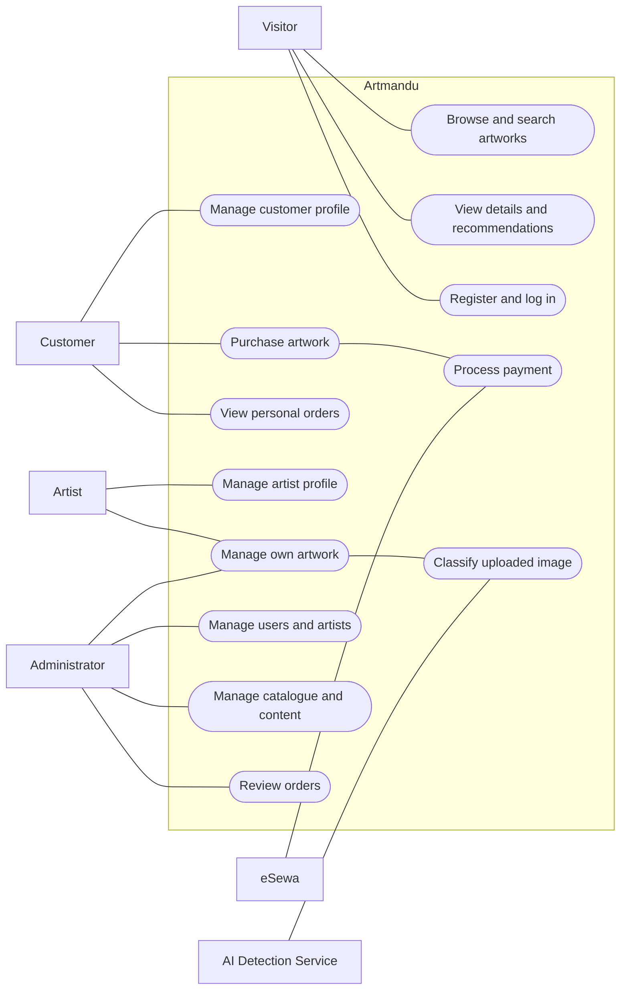
```mermaid
flowchart LR
    Visitor[Visitor]
    Customer[Customer]
    Artist[Artist]
    Admin[Administrator]
    Esewa[eSewa]
    AI[AI Detection Service]

    subgraph Artmandu
        UC1([Browse and search artworks])
        UC2([View details and recommendations])
        UC3([Register and log in])
        UC4([Manage customer profile])
        UC5([Purchase artwork])
        UC6([View personal orders])
        UC7([Manage artist profile])
        UC8([Manage own artwork])
        UC9([Manage users and artists])
        UC10([Manage catalogue and content])
        UC11([Review orders])
        UC12([Process payment])
        UC13([Classify uploaded image])
    end

    Visitor --- UC1
    Visitor --- UC2
    Visitor --- UC3
    Customer --- UC4
    Customer --- UC5
    Customer --- UC6
    Artist --- UC7
    Artist --- UC8
    Admin --- UC9
    Admin --- UC10
    Admin --- UC11
    Admin --- UC8
    UC5 --- UC12
    Esewa --- UC12
    UC8 --- UC13
    AI --- UC13
```

**Figure 3.1: Use-case model of Artmandu**

**Table 3.2: Use-case descriptions**

| ID | Use case | Preconditions | Main outcome | Alternative/failure behavior |
|---|---|---|---|---|
| UC-01 | Browse/search artwork | None | Matching catalogue items are displayed. | No match produces an empty result. |
| UC-02 | Register | Unique username and email; valid fields | A customer account with a password hash is created. | Invalid or duplicate data produces a validation message. |
| UC-03 | Log in | Existing account | A session is created and the user is routed by role. | Unknown username or invalid password is rejected. |
| UC-04 | Manage profile | Authenticated customer/artist | Permitted profile fields are updated. | Invalid or unauthorized requests are rejected. |
| UC-05 | Manage artwork | Artist or administrator session | Artwork is created, updated, listed, or deleted. | Artist ownership checks prevent modifying another artist’s item. |
| UC-06 | Classify image | Valid primary-image upload | Detection result is stored with the artwork. | Service failure allows upload with an unknown result. |
| UC-07 | Recommend artwork | Existing artwork | Up to four similar items are ranked and displayed. | Missing or unmatched data yields no recommendations. |
| UC-08 | Purchase artwork | Authenticated customer and valid details | A pending order is created and payment begins. | Invalid fields stop submission; database failure reports an error. |
| UC-09 | Process payment | Pending order and product price | Signed request is sent and returned signature is checked. | Failure or invalid signature returns an error message. |
| UC-10 | Review order | Administrator session and pending order | Status becomes Approved or Cancelled with a remark. | Missing/invalid selection leaves the order unchanged. |

#### 3.1.1.2 Non-Functional Requirements

**Table 3.3: Non-functional requirements**

| Category | Requirement |
|---|---|
| Usability | Navigation, forms, validation feedback, and role-specific screens should be understandable without specialist training. |
| Performance | Normal catalogue and administrative pages should return without unnecessary blocking; AI calls use a ten-second PHP timeout. |
| Security | Passwords must be hashed, protected pages must validate sessions and roles, output/input must be handled safely, and payment signatures must be verified. |
| Reliability | Database and external-service failures must not silently corrupt existing records. An unavailable detector must produce an unknown classification rather than a fabricated result. |
| Maintainability | Shared database, header, footer, recommendation, and CNN helper concerns should remain separated from page markup. |
| Portability | The web system should run through Docker Compose or a compatible PHP/Apache and MariaDB/MySQL environment. |
| Scalability | Catalogue queries, indexes, image storage, and service deployment should permit growth beyond demonstration data. |
| Compatibility | The user interface should adapt to common desktop and mobile browser sizes. |

### 3.1.2 Feasibility Analysis

**Table 3.4: Feasibility analysis**

| Area | Analysis |
|---|---|
| Technical | PHP, Apache, MariaDB/MySQL, FastAPI, PyTorch, and browser technologies are available and represented in the repository. The CNN service needs separate Python dependencies and model access. |
| Operational | Visitors, customers, artists, and administrators receive distinct workflows. Routine catalogue and order tasks can be performed from web interfaces. |
| Economic | The software stack is based primarily on open-source technologies. Hosting, storage, model computation, payment-merchant setup, backups, and maintenance remain operational costs. |
| Schedule | The modular page structure supports phased delivery: catalogue, accounts, role portals, orders/payment, recommendations, detection, testing, and documentation. |

### 3.1.3 Object Modeling Using Class and Object Diagrams

The following analysis model treats database-backed concepts as domain classes. Operations express responsibilities observed in the application and are not declarations of matching PHP methods.

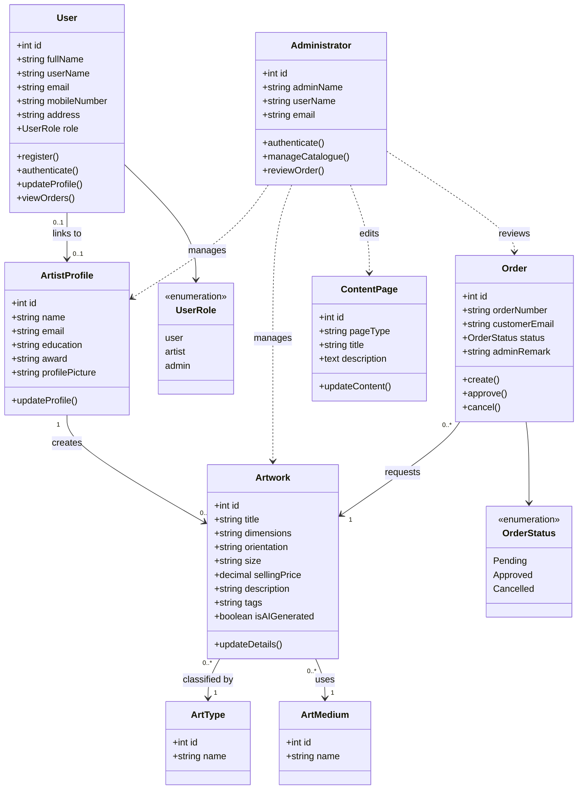
```mermaid
classDiagram
    class User {
        +int id
        +string fullName
        +string userName
        +string email
        +string mobileNumber
        +string address
        +UserRole role
        +register()
        +authenticate()
        +updateProfile()
        +viewOrders()
    }
    class Administrator {
        +int id
        +string adminName
        +string userName
        +string email
        +authenticate()
        +manageCatalogue()
        +reviewOrder()
    }
    class ArtistProfile {
        +int id
        +string name
        +string email
        +string education
        +string award
        +string profilePicture
        +updateProfile()
    }
    class Artwork {
        +int id
        +string title
        +string dimensions
        +string orientation
        +string size
        +decimal sellingPrice
        +string description
        +string tags
        +boolean isAIGenerated
        +updateDetails()
    }
    class ArtType {
        +int id
        +string name
    }
    class ArtMedium {
        +int id
        +string name
    }
    class Order {
        +int id
        +string orderNumber
        +string customerEmail
        +OrderStatus status
        +string adminRemark
        +create()
        +approve()
        +cancel()
    }
    class ContentPage {
        +int id
        +string pageType
        +string title
        +text description
        +updateContent()
    }
    class UserRole {
        <<enumeration>>
        user
        artist
        admin
    }
    class OrderStatus {
        <<enumeration>>
        Pending
        Approved
        Cancelled
    }

    User "0..1" --> "0..1" ArtistProfile : links to
    User --> UserRole
    ArtistProfile "1" --> "0..*" Artwork : creates
    Artwork "0..*" --> "1" ArtType : classified by
    Artwork "0..*" --> "1" ArtMedium : uses
    Order "0..*" --> "1" Artwork : requests
    Order --> OrderStatus
    Administrator ..> ArtistProfile : manages
    Administrator ..> Artwork : manages
    Administrator ..> ContentPage : edits
    Administrator ..> Order : reviews
```

**Figure 3.2: Conceptual class diagram**

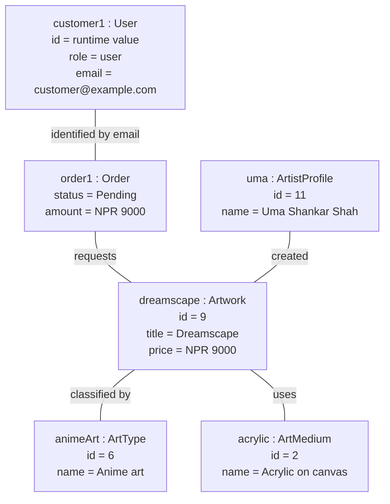
```mermaid
flowchart TB
    Customer["customer1 : User<br/>id = runtime value<br/>role = user<br/>email = customer@example.com"]
    Order1["order1 : Order<br/>status = Pending<br/>amount = NPR 9000"]
    Art["dreamscape : Artwork<br/>id = 9<br/>title = Dreamscape<br/>price = NPR 9000"]
    Artist1["uma : ArtistProfile<br/>id = 11<br/>name = Uma Shankar Shah"]
    Type1["animeArt : ArtType<br/>id = 6<br/>name = Anime art"]
    Medium1["acrylic : ArtMedium<br/>id = 2<br/>name = Acrylic on canvas"]

    Customer ---|identified by email| Order1
    Order1 ---|requests| Art
    Artist1 ---|created| Art
    Art ---|classified by| Type1
    Art ---|uses| Medium1
```

**Figure 3.3: Conceptual object diagram**

The seeded artist, artwork, type, medium, and price are drawn from `database/newagms.sql`. The customer and order are illustrative runtime instances because the database dump does not seed those records.

### 3.1.4 Dynamic Modeling Using State and Sequence Diagrams

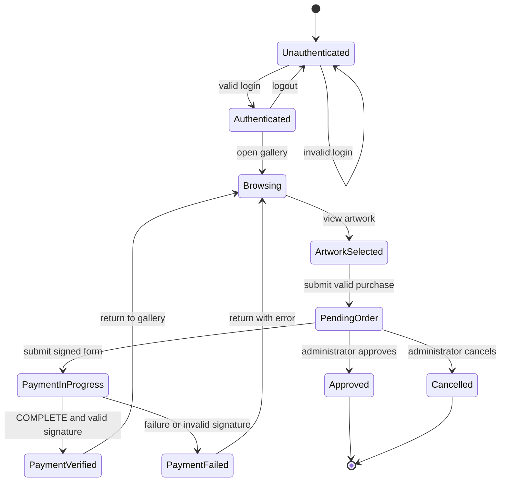
```mermaid
stateDiagram-v2
    [*] --> Unauthenticated
    Unauthenticated --> Authenticated : valid login
    Unauthenticated --> Unauthenticated : invalid login
    Authenticated --> Browsing : open gallery
    Browsing --> ArtworkSelected : view artwork
    ArtworkSelected --> PendingOrder : submit valid purchase
    PendingOrder --> PaymentInProgress : submit signed form
    PaymentInProgress --> PaymentVerified : COMPLETE and valid signature
    PaymentInProgress --> PaymentFailed : failure or invalid signature
    PendingOrder --> Approved : administrator approves
    PendingOrder --> Cancelled : administrator cancels
    PaymentVerified --> Browsing : return to gallery
    PaymentFailed --> Browsing : return with error
    Approved --> [*]
    Cancelled --> [*]
    Authenticated --> Unauthenticated : logout
```

**Figure 3.4: System and order state diagram**

Payment verification and stored order status are separate in the current application. A successful payment sets a session message but does not change the persisted `Pending` order; `Approved` and `Cancelled` are stored only during administrator review.

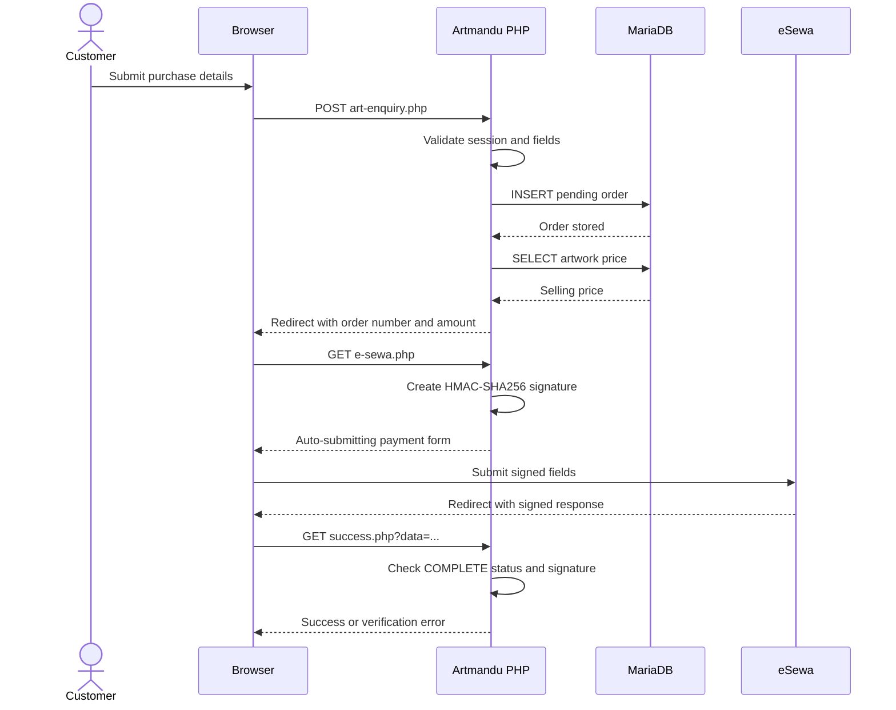
```mermaid
sequenceDiagram
    actor Customer
    participant Browser
    participant PHP as Artmandu PHP
    participant DB as MariaDB
    participant eSewa

    Customer->>Browser: Submit purchase details
    Browser->>PHP: POST art-enquiry.php
    PHP->>PHP: Validate session and fields
    PHP->>DB: INSERT pending order
    DB-->>PHP: Order stored
    PHP->>DB: SELECT artwork price
    DB-->>PHP: Selling price
    PHP-->>Browser: Redirect with order number and amount
    Browser->>PHP: GET e-sewa.php
    PHP->>PHP: Create HMAC-SHA256 signature
    PHP-->>Browser: Auto-submitting payment form
    Browser->>eSewa: Submit signed fields
    eSewa-->>Browser: Redirect with signed response
    Browser->>PHP: GET success.php?data=...
    PHP->>PHP: Check COMPLETE status and signature
    PHP-->>Browser: Success or verification error
```

**Figure 3.5: Purchase and eSewa sequence diagram**

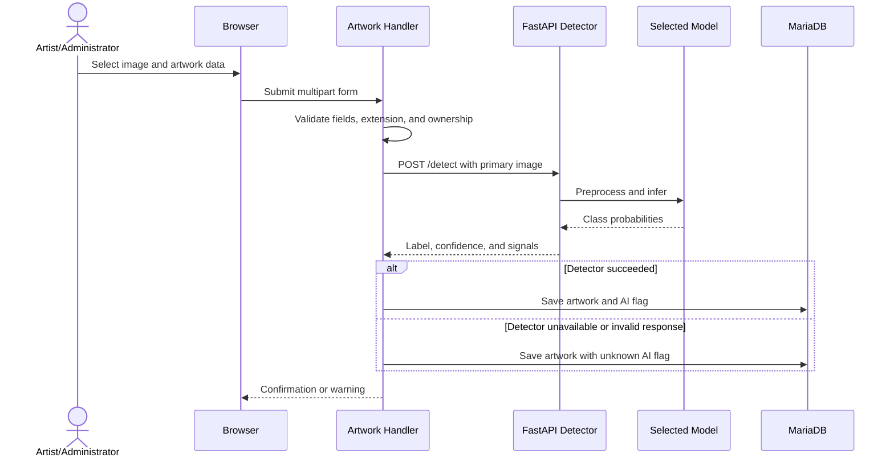
```mermaid
sequenceDiagram
    actor Owner as Artist/Administrator
    participant Browser
    participant PHP as Artwork Handler
    participant CNN as FastAPI Detector
    participant Model as Selected Model
    participant DB as MariaDB

    Owner->>Browser: Select image and artwork data
    Browser->>PHP: Submit multipart form
    PHP->>PHP: Validate fields, extension, and ownership
    PHP->>CNN: POST /detect with primary image
    CNN->>Model: Preprocess and infer
    Model-->>CNN: Class probabilities
    CNN-->>PHP: Label, confidence, and signals
    alt Detector succeeded
        PHP->>DB: Save artwork and AI flag
    else Detector unavailable or invalid response
        PHP->>DB: Save artwork with unknown AI flag
    end
    PHP-->>Browser: Confirmation or warning
```

**Figure 3.6: Artwork upload and AI-detection sequence diagram**

### 3.1.5 Process Modeling Using Activity Diagrams

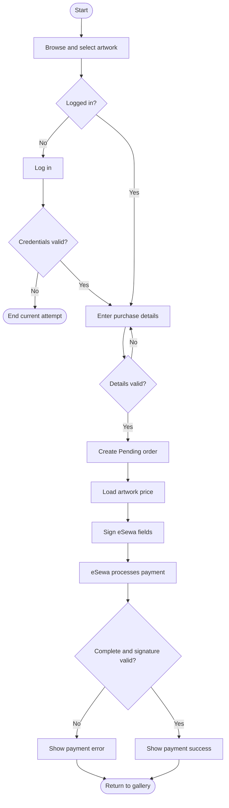
```mermaid
flowchart TD
    A([Start]) --> B[Browse and select artwork]
    B --> C{Logged in?}
    C -- No --> D[Log in]
    D --> E{Credentials valid?}
    E -- No --> X([End current attempt])
    E -- Yes --> F[Enter purchase details]
    C -- Yes --> F
    F --> G{Details valid?}
    G -- No --> F
    G -- Yes --> H[Create Pending order]
    H --> I[Load artwork price]
    I --> J[Sign eSewa fields]
    J --> K[eSewa processes payment]
    K --> L{Complete and signature valid?}
    L -- No --> M[Show payment error]
    L -- Yes --> N[Show payment success]
    M --> O([Return to gallery])
    N --> O
```

**Figure 3.7: Purchase activity diagram**

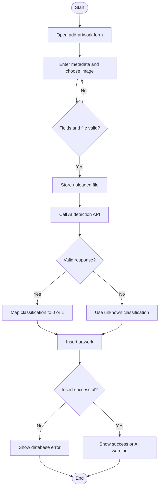
```mermaid
flowchart TD
    A([Start]) --> B[Open add-artwork form]
    B --> C[Enter metadata and choose image]
    C --> D{Fields and file valid?}
    D -- No --> C
    D -- Yes --> E[Store uploaded file]
    E --> F[Call AI detection API]
    F --> G{Valid response?}
    G -- Yes --> H[Map classification to 0 or 1]
    G -- No --> I[Use unknown classification]
    H --> J[Insert artwork]
    I --> J
    J --> K{Insert successful?}
    K -- No --> L[Show database error]
    K -- Yes --> M[Show success or AI warning]
    L --> N([End])
    M --> N
```

**Figure 3.8: Artwork submission activity diagram**

## 3.2 System Design

### 3.2.1 Refinement of Class, Object, State, Sequence, and Activity Diagrams

The design model adds boundary, controller, service, and infrastructure responsibilities. These classes group behavior currently distributed across procedural PHP pages; only the Python detector implementations are literal implementation classes.

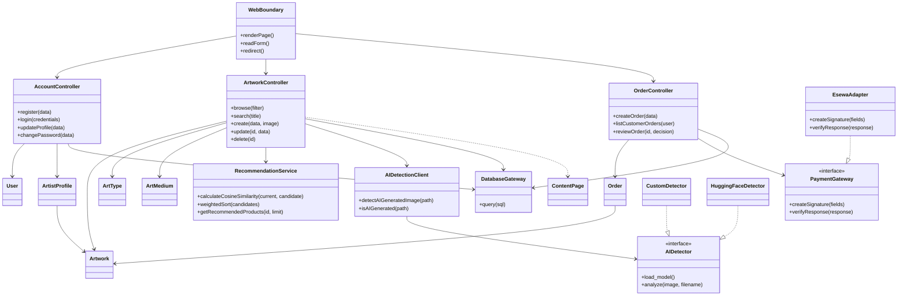
```mermaid
classDiagram
    class WebBoundary {
        +renderPage()
        +readForm()
        +redirect()
    }
    class AccountController {
        +register(data)
        +login(credentials)
        +updateProfile(data)
        +changePassword(data)
    }
    class ArtworkController {
        +browse(filter)
        +search(title)
        +create(data, image)
        +update(id, data)
        +delete(id)
    }
    class OrderController {
        +createOrder(data)
        +listCustomerOrders(user)
        +reviewOrder(id, decision)
    }
    class RecommendationService {
        +calculateCosineSimilarity(current, candidate)
        +weightedSort(candidates)
        +getRecommendedProducts(id, limit)
    }
    class AIDetectionClient {
        +detectAIGeneratedImage(path)
        +isAIGenerated(path)
    }
    class PaymentGateway {
        <<interface>>
        +createSignature(fields)
        +verifyResponse(response)
    }
    class EsewaAdapter {
        +createSignature(fields)
        +verifyResponse(response)
    }
    class DatabaseGateway {
        +query(sql)
    }
    class User
    class ArtistProfile
    class Artwork
    class ArtType
    class ArtMedium
    class Order
    class ContentPage
    class AIDetector {
        <<interface>>
        +load_model()
        +analyze(image, filename)
    }
    class CustomDetector
    class HuggingFaceDetector

    WebBoundary --> AccountController
    WebBoundary --> ArtworkController
    WebBoundary --> OrderController
    AccountController --> User
    AccountController --> ArtistProfile
    ArtworkController --> Artwork
    ArtworkController --> ArtType
    ArtworkController --> ArtMedium
    ArtworkController --> RecommendationService
    ArtworkController --> AIDetectionClient
    OrderController --> Order
    OrderController --> PaymentGateway
    EsewaAdapter ..|> PaymentGateway
    AccountController --> DatabaseGateway
    ArtworkController --> DatabaseGateway
    OrderController --> DatabaseGateway
    AIDetectionClient --> AIDetector
    CustomDetector ..|> AIDetector
    HuggingFaceDetector ..|> AIDetector
    ArtistProfile --> Artwork
    Order --> Artwork
    ArtworkController ..> ContentPage
```

**Figure 3.9: Refined class diagram**

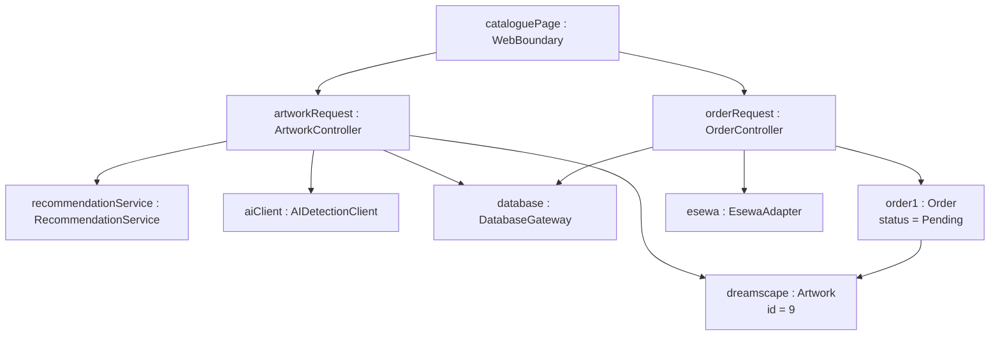
```mermaid
flowchart TB
    UI["cataloguePage : WebBoundary"]
    AC["artworkRequest : ArtworkController"]
    RS["recommendationService : RecommendationService"]
    AI["aiClient : AIDetectionClient"]
    DB["database : DatabaseGateway"]
    ART["dreamscape : Artwork<br/>id = 9"]
    ORD["orderRequest : OrderController"]
    ORDER["order1 : Order<br/>status = Pending"]
    PAY["esewa : EsewaAdapter"]

    UI --> AC
    AC --> ART
    AC --> RS
    AC --> AI
    AC --> DB
    UI --> ORD
    ORD --> ORDER
    ORDER --> ART
    ORD --> PAY
    ORD --> DB
```

**Figure 3.10: Refined object diagram**

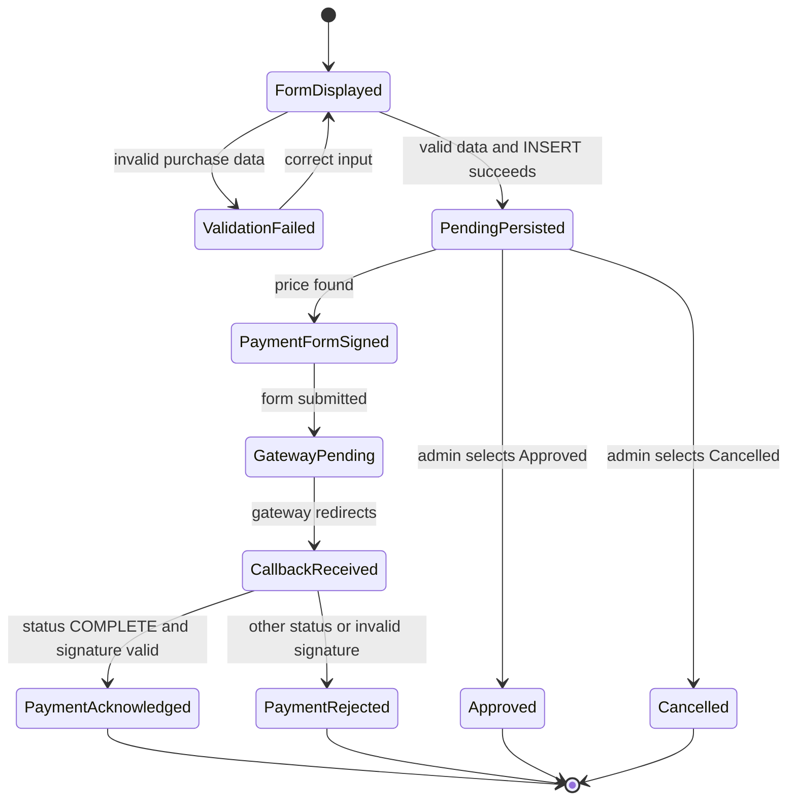
```mermaid
stateDiagram-v2
    [*] --> FormDisplayed
    FormDisplayed --> ValidationFailed : invalid purchase data
    ValidationFailed --> FormDisplayed : correct input
    FormDisplayed --> PendingPersisted : valid data and INSERT succeeds
    PendingPersisted --> PaymentFormSigned : price found
    PaymentFormSigned --> GatewayPending : form submitted
    GatewayPending --> CallbackReceived : gateway redirects
    CallbackReceived --> PaymentAcknowledged : status COMPLETE and signature valid
    CallbackReceived --> PaymentRejected : other status or invalid signature
    PendingPersisted --> Approved : admin selects Approved
    PendingPersisted --> Cancelled : admin selects Cancelled
    PaymentAcknowledged --> [*]
    PaymentRejected --> [*]
    Approved --> [*]
    Cancelled --> [*]
```

**Figure 3.11: Refined order state diagram**

```mermaid
sequenceDiagram
    actor Actor
    participant UI as WebBoundary
    participant Controller
    participant Service
    participant DB as DatabaseGateway
    participant External as External Service

    Actor->>UI: Submit request
    UI->>Controller: Validated form/session data
    Controller->>DB: Load required domain records
    DB-->>Controller: Rows or no result
    alt External operation required
        Controller->>Service: Execute domain operation
        Service->>External: HTTP/form request
        External-->>Service: Response
        Service-->>Controller: Normalized result/error
    end
    Controller->>DB: Persist permitted change
    DB-->>Controller: Success/failure
    Controller-->>UI: Result and next route
    UI-->>Actor: Render message/page
```

**Figure 3.12: Refined request sequence diagram**

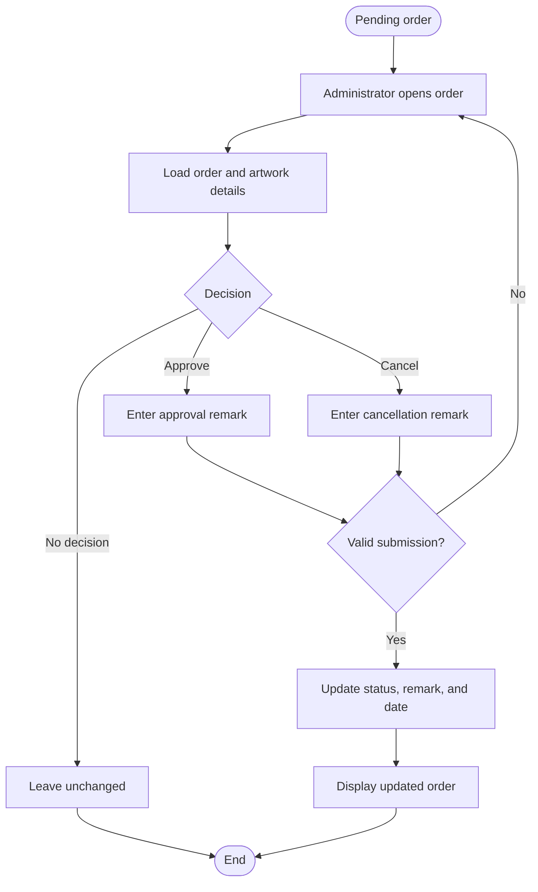
```mermaid
flowchart TD
    A([Pending order]) --> B[Administrator opens order]
    B --> C[Load order and artwork details]
    C --> D{Decision}
    D -- Approve --> E[Enter approval remark]
    D -- Cancel --> F[Enter cancellation remark]
    D -- No decision --> G[Leave unchanged]
    E --> H{Valid submission?}
    F --> H
    H -- No --> B
    H -- Yes --> I[Update status, remark, and date]
    I --> J[Display updated order]
    G --> K([End])
    J --> K
```

**Figure 3.13: Refined order-review activity diagram**

**Table 3.5: Conceptual-to-implementation mapping**

| OO responsibility | Current implementation |
|---|---|
| AccountController | `register.php`, `login.php`, profile/password pages, and admin authentication pages |
| ArtworkController | Public catalogue pages plus `artist/` and `admin/` artwork handlers |
| OrderController | `art-enquiry.php`, `my-orders.php`, and `admin/view-order-detail.php` |
| RecommendationService | Functions in `includes/recommendation_functions.php` |
| AIDetectionClient | Functions in `includes/cnn_helper.php` |
| EsewaAdapter | Request construction in `e-sewa.php` and callback checking in `esewa/` |
| DatabaseGateway | Shared MySQLi connections and SQL executed in page handlers |
| AIDetector implementations | `CustomDetector` and `HuggingFaceDetector` in `cnn/detector.py` |

### 3.2.2 Component Diagram

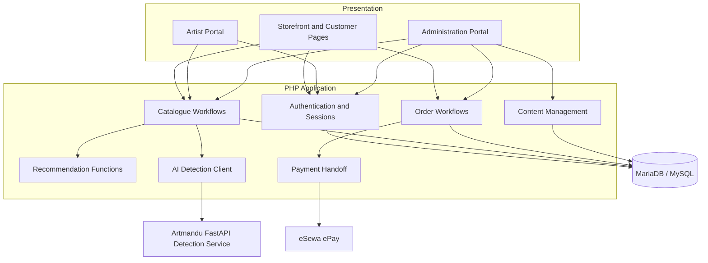
```mermaid
flowchart TB
    subgraph Presentation
        Store[Storefront and Customer Pages]
        ArtistUI[Artist Portal]
        AdminUI[Administration Portal]
    end
    subgraph PHPApplication[PHP Application]
        Auth[Authentication and Sessions]
        Catalogue[Catalogue Workflows]
        Orders[Order Workflows]
        Recommend[Recommendation Functions]
        CNNClient[AI Detection Client]
        Payment[Payment Handoff]
        Content[Content Management]
    end
    DB[(MariaDB / MySQL)]
    CNN[Artmandu FastAPI Detection Service]
    Esewa[eSewa ePay]

    Store --> Auth
    Store --> Catalogue
    Store --> Orders
    ArtistUI --> Auth
    ArtistUI --> Catalogue
    AdminUI --> Auth
    AdminUI --> Catalogue
    AdminUI --> Orders
    AdminUI --> Content
    Catalogue --> Recommend
    Catalogue --> CNNClient
    Auth --> DB
    Catalogue --> DB
    Orders --> DB
    Content --> DB
    CNNClient --> CNN
    Orders --> Payment
    Payment --> Esewa
```

**Figure 3.14: Component diagram**

### 3.2.3 Deployment Diagram

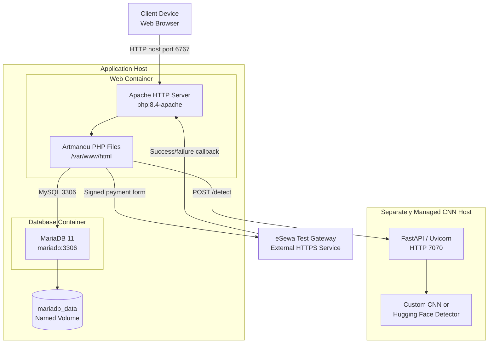
```mermaid
flowchart TB
    Client[Client Device<br/>Web Browser]
    Esewa[eSewa Test Gateway<br/>External HTTPS Service]

    subgraph DockerHost[Application Host]
        subgraph WebContainer[Web Container]
            Apache[Apache HTTP Server<br/>php:8.4-apache]
            PHP[Artmandu PHP Files<br/>/var/www/html]
            Apache --> PHP
        end
        subgraph DBContainer[Database Container]
            MariaDB[MariaDB 11<br/>mariadb:3306]
        end
        Volume[(mariadb_data<br/>Named Volume)]
        MariaDB --> Volume
    end

    subgraph CNNHost[Separately Managed CNN Host]
        FastAPI[FastAPI / Uvicorn<br/>HTTP 7070]
        Detector[Custom CNN or<br/>Hugging Face Detector]
        FastAPI --> Detector
    end

    Client -->|HTTP host port 6767| Apache
    PHP -->|MySQL 3306| MariaDB
    PHP -->|POST /detect| FastAPI
    PHP -->|Signed payment form| Esewa
    Esewa -->|Success/failure callback| Apache
```

**Figure 3.15: Deployment diagram**

Docker Compose creates a network on which containers can discover one another by service name [10]. In the current configuration, the web and MariaDB services are in Compose, the database uses a named volume, and the CNN service is started independently.

## 3.3 Algorithm Details

### 3.3.1 Artwork Recommendation

For a current artwork and each candidate artwork, the implementation creates this binary vector:

\[
A = [\text{sameArtType},\ \text{sameArtMedium},\ \text{sameArtist}]
\]

It compares that vector with the ideal match vector \(B=[1,1,1]\):

\[
\operatorname{cosine}(A,B)=\frac{A\cdot B}{\lVert A\rVert\lVert B\rVert}
\]

If no attributes match, the magnitude of \(A\) is zero and the score is returned as zero. Candidates with a positive score are retained, sorted in descending order, and limited to four.

The source defines weights of `0.50`, `0.25`, `0.15`, and `0.10` for art type, artist, art medium, and price. However, it multiplies the same cosine score by every weight, and the weights sum to `1.00`. Therefore, the current weighted score is mathematically equal to the cosine score; price does not independently affect ranking. This report records the implemented behavior rather than claiming attribute weighting that the code does not perform.

### 3.3.2 AI-Image Classification

1. Validate the uploaded file path in PHP.
2. Send the image as multipart form data to `POST /detect` with a ten-second timeout.
3. Reject files larger than the configured maximum or with unsupported MIME types.
4. Resize and normalize the image according to the selected detector.
5. Run either `CustomDetector` or `HuggingFaceDetector` without gradient calculation.
6. Apply softmax to obtain human and AI probabilities.
7. Mark the image AI-generated only when AI probability exceeds human probability and the configured confidence threshold.
8. Return the prediction, confidence, signals, model name, and processing time.
9. Store `1`, `0`, or `NULL` in the artwork record depending on success and classification.

### 3.3.3 eSewa Signature Processing

The request message is constructed in this fixed order:

```text
total_amount={amount},transaction_uuid={orderNumber},product_code=EPAYTEST
```

The PHP application calculates HMAC-SHA256 using the test secret and Base64-encodes the result. On success callback, it rebuilds the message from `signed_field_names`, recalculates the signature, and compares it with the returned signature. The official documentation additionally recommends transaction-status verification before updating payment state [8]; the current implementation does not persist a separate verified payment status.

---

# Chapter 4: Implementation and Testing

## 4.1 Implementation

### 4.1.1 Tools Used

**Table 4.1: Implementation tools and technologies**

| Area | Technology | Use in Artmandu |
|---|---|---|
| Presentation | HTML, CSS, Bootstrap, JavaScript, jQuery | Responsive pages, forms, validation, navigation, and image presentation |
| Web application | PHP 8-compatible procedural code | Request handling, sessions, validation, SQL access, recommendation, and integrations |
| Database | MariaDB/MySQL and MySQLi | Persistent users, administrators, artists, catalogue data, pages, and orders [9] |
| AI API | Python and FastAPI | `/health` and `/detect` endpoints [6] |
| AI inference | PyTorch, torchvision, Transformers | Preprocessing and custom/Hugging Face classification |
| Payment | eSewa ePay test integration | Signed form handoff and callback verification [8] |
| Deployment | Apache, Docker, Docker Compose | Repeatable web and database services [10] |
| Development | Visual Studio Code, Git | Source editing and version control |
| Analysis/design | UML and Mermaid | Editable structural and behavioral documentation [1] |

### 4.1.2 Implementation Details of Modules

**Table 4.2: Implemented modules**

| Module | Main behavior | Representative implementation |
|---|---|---|
| Public catalogue | Lists products, filters by art type, searches titles, and displays product, artist, medium, and type details. | `index.php`, `product.php`, `search.php`, `single-product.php` |
| Customer accounts | Registers users, hashes passwords, authenticates, stores sessions, updates profiles, and changes passwords. | `register.php`, `login.php`, `my-profile.php`, `change-password.php` |
| Artist portal | Routes artist users, displays owned-artwork summaries, maintains artist information, and restricts artwork changes by artist profile. | `artist/dashboard.php`, `artist/profile.php`, `artist/add-art.php`, `artist/edit-art.php`, `artist/manage-art.php` |
| Administration | Manages users, artists, classifications, artwork, pages, dashboard totals, and order outcomes. | `admin/` request handlers |
| Orders | Validates customer details, creates a pending order, displays customer orders, and stores administrator decisions. | `art-enquiry.php`, `my-orders.php`, `admin/view-order-detail.php` |
| Payment | Creates an eSewa signature, submits the form, and checks callback status/signature. | `e-sewa.php`, `esewa/success.php`, `esewa/failure.php` |
| Recommendation | Computes cosine similarity, sorts positive matches, and returns the top four candidates. | `includes/recommendation_functions.php` |
| AI detection | Uploads images to the detector and normalizes service results. | `includes/cnn_helper.php`, `admin/cnn_detect.php` |
| CNN service | Validates uploaded images and runs the selected model. | `cnn/app.py`, `cnn/detector.py`, `cnn/model/cnn_architecture.py` |
| Persistence/deployment | Defines tables and migrations and runs Apache with MariaDB. | `database/`, `Dockerfile`, `docker-compose.yml` |

The main PHP layer is procedural. The OO diagrams group related responsibilities into conceptual controllers and services to show how a future refactoring could improve separation without asserting that this refactoring has already occurred. The Python detector is object-oriented and provides a common `AIDetector` selection between custom and Hugging Face implementations.

## 4.2 Testing

### 4.2.1 Unit Testing Test Cases

**Table 4.3: Unit test cases**

| ID | Unit | Input/condition | Expected result | Evidence/status |
|---|---|---|---|---|
| UT-01 | `calculateCosineSimilarity` | Candidate matches type, medium, and artist | Score is `1.0`. | Code-derived test case; PHP test not automated. |
| UT-02 | `calculateCosineSimilarity` | Candidate matches no attribute | Score is `0` without division by zero. | Explicit branch exists; PHP test not automated. |
| UT-03 | `getRecommendedProducts` | More than four positive matches | Results are descending and limited to four. | Explicit `usort`/`array_slice`; PHP test not automated. |
| UT-04 | Registration validation | Duplicate username or email | Account is rejected with a message. | Implemented in `register.php`; manual verification required. |
| UT-05 | Password verification | Correct and incorrect passwords | Correct hash passes; incorrect password fails. | Uses PHP password API [2], [3]; manual verification required. |
| UT-06 | Detector health | `GET /health` | HTTP 200 with `status=ok`. | Automated test exists in `cnn/tests/test_api.py`. |
| UT-07 | Detector missing file | `POST /detect` without image | HTTP 422 validation response. | Automated test exists in `cnn/tests/test_api.py`. |
| UT-08 | Detector prediction | Valid temporary image | Prediction contains label, confidence, and AI flag. | Automated tests exist in `cnn/tests/test_api.py` and `test_detector.py`; model availability affects execution. |
| UT-09 | Detector validation | Oversized or unsupported upload | HTTP 413 or 400 respectively. | Implemented branches; dedicated automated cases are not present. |
| UT-10 | Payment callback | COMPLETE response with altered signature | Callback is rejected. | Implemented verification branch; integration test not automated. |

### 4.2.2 System Testing Test Cases

**Table 4.4: System test cases**

| ID | Scenario | Steps | Expected result | Documentation status |
|---|---|---|---|---|
| ST-01 | Customer registration and login | Register valid unique details, then log in. | Account is stored with a hash and customer session opens the storefront. | Implemented; manual end-to-end execution required. |
| ST-02 | Role routing | Log in as customer and artist; use separate admin login. | Each identity reaches its permitted interface. | Implemented; manual execution required. |
| ST-03 | Catalogue discovery | Browse types, search a known title, and open details. | Correct products and related records are displayed. | Implemented; screenshot evidence available. |
| ST-04 | Recommendations | Open an artwork with matching catalogue items. | At most four positive-similarity candidates appear. | Implemented; screenshot evidence available. |
| ST-05 | Artist ownership | Attempt to edit/delete an artwork belonging to another artist. | The ownership-restricted query prevents the change. | Implemented for artist pages; negative test recommended. |
| ST-06 | Artwork upload with detector | Upload a supported image while the CNN service is available. | Artwork is stored with classification and an appropriate message. | Implemented; requires model/service runtime. |
| ST-07 | Detector unavailable | Upload while the CNN service is unreachable. | Artwork may be stored with an unknown AI value; failure is logged. | Implemented fallback; manual execution required. |
| ST-08 | Purchase and payment | Log in, submit valid purchase data, and complete eSewa test flow. | Pending order is stored and valid callback produces a success message. | Implemented; screenshot evidence available. |
| ST-09 | Invalid payment response | Alter status or signature in returned data. | Verification fails and an error message is stored in the session. | Implemented; integration test recommended. |
| ST-10 | Administrator order review | Open a pending order and approve/cancel with a remark. | Stored status, remark, and update time change. | Implemented; manual execution required. |
| ST-11 | Responsive presentation | Open principal pages at desktop and mobile widths. | Content remains usable without horizontal loss of core controls. | CSS support exists; visual verification required. |

Statuses in these tables distinguish implemented behavior and existing automated coverage from tests that still require manual execution. No unexecuted scenario is presented as a measured pass.

## 4.3 Result Analysis

The system was evaluated at two levels: functional system behaviour and quantitative performance of the custom CNN image classifier. Functional results are based on the unit and system scenarios in Tables 4.3 and 4.4. CNN results must be calculated on the held-out validation split using `cnn/train/evaluate.py`; this keeps the test images separate from training and uses exactly the preprocessing used during training. The two classes are `real` (human-created) and `ai` (AI-generated), with `ai` treated as the positive class.

For a binary classifier, the confusion matrix is reported as actual rows and predicted columns:

|  | Predicted real | Predicted ai |
|---|---:|---:|
| Actual real | TN = **[RUN: tn]** | FP = **[RUN: fp]** |
| Actual ai | FN = **[RUN: fn]** | TP = **[RUN: tp]** |

The evaluation reports accuracy, precision, recall, and F1-score. Accuracy is `(TP + TN) / (TP + TN + FP + FN)`. Precision for the positive class is `TP / (TP + FP)`, recall is `TP / (TP + FN)`, and F1-score is the harmonic mean `2 × precision × recall / (precision + recall)`. Because both classes matter, the results table includes scikit-learn weighted averages as well as class-level scores.

**Table 4.5: Custom CNN evaluation results**

| Measure | Real class | AI class | Weighted average / overall |
|---|---:|---:|---:|
| Support (images) | **[RUN: real_support]** | **[RUN: ai_support]** | **[RUN: samples]** |
| Precision | **[RUN: real_precision]** | **[RUN: ai_precision]** | **[RUN: weighted_precision]** |
| Recall | **[RUN: real_recall]** | **[RUN: ai_recall]** | **[RUN: weighted_recall]** |
| F1-score | **[RUN: real_f1]** | **[RUN: ai_f1]** | **[RUN: weighted_f1]** |
| Accuracy | — | — | **[RUN: accuracy]** |

The values marked **[RUN: …]** are deliberately not estimated: the repository currently contains no validation images or trained `cnn_best.pth` file. After those files are added, run `python3 cnn/train/evaluate.py cnn/data --weights cnn/model/weights/cnn_best.pth --output cnn/evaluation_results.json` and copy the generated values into this table. The confusion-matrix counts must sum to the reported sample count. A high false-positive count means that human artwork is being incorrectly flagged, while a high false-negative count means that AI-generated artwork is being missed; these two errors have different operational consequences for the gallery.

The system-level results show that the public catalogue, role-specific workflows, artist-owned artwork management, recommendation display, purchase initiation, payment callback handling, administration, and CNN integration are implemented. The recommendation function returns up to four positive-similarity items, but it is not a supervised classifier and therefore does not receive a confusion matrix or classification scores. Its result is assessed by whether the returned items share catalogue attributes and are sorted by similarity. Likewise, any Weighted Moving Average component should be reported with forecasting measures such as MAE or RMSE rather than CNN classification measures.

The measured CNN scores describe performance on the selected validation set, not proof that every uploaded image is correctly classified. Results can change with class balance, image source, threshold, and dataset leakage. The detector therefore provides an automated warning signal and should remain subject to administrator review.

**Table 4.6: Objective and result analysis**

| Objective | Result and evidence | Limitation |
|---|---|---|
| Present artwork and artist information | Public catalogue, classifications, details, images, and artist records are available. | Search and filtering are basic. |
| Support multiple roles | Customer, artist, and administrator interfaces and sessions are implemented. | Admin identity is split between `tbladmin` and an optional user role. |
| Let artists manage their work | Artist-owned list, add, edit, and delete flows are present. | More centralized authorization would improve consistency. |
| Recommend related artwork | Attribute-match cosine ranking returns up to four products. | No behavioural personalization exists. |
| Detect AI-generated images | Custom CNN evaluation produces a confusion matrix, accuracy, precision, recall, and F1-score after the supplied evaluation run. | Availability depends on the separately started service; classification is not definitive proof. |
| Support purchasing | Pending orders, eSewa handoff, callbacks, and personal order display exist. | Verified payment status is not stored against the order. |
| Support administration | Catalogue, people, content, dashboard, and order workflows exist. | Database constraints and controller separation can be strengthened. |
| Provide repeatable deployment | Apache/PHP and MariaDB are defined in Compose with persistent database storage. | CNN is outside Compose and environment-specific URLs remain. |

Overall, the implementation meets the main demonstration goals while the quantitative CNN evidence makes its performance auditable. The main remaining engineering gaps are payment-state persistence, consistent relational constraints, centralized authorization, prepared queries across all handlers, independent recommendation weighting, automated PHP integration tests, and unified service configuration.

---

# Chapter 5: Conclusion and Future Recommendations

## 5.1 Conclusion

Artmandu demonstrates a complete web-based path from artwork presentation to user discovery, role-based management, recommendation, purchase initiation, payment handoff, and administrative order review. It provides meaningful facilities for customers, artists, and administrators while integrating a separately deployable AI classifier. The work also demonstrates how established web technologies can be combined with recommendation and image-classification capabilities in a single academic project.

Applying OOAD clarifies the structure that is less visible in the procedural PHP source. Users, artist profiles, artworks, catalogue classifications, orders, content pages, and external-service adapters form stable domain concepts. Controllers and services provide a useful design separation for account, artwork, recommendation, payment, and detection responsibilities. This modeling exercise makes the system easier to explain, test, and evolve without falsely presenting the current PHP implementation as class-based.

The project reinforced the importance of traceable requirements, consistent naming, explicit state modeling, external-service failure handling, and alignment between documentation and implemented behavior. It also showed that a working feature is not the same as a production-ready feature: payment reconciliation, authorization, data integrity, and repeatable testing require deliberate design.

## 5.2 Future Recommendations

- Refactor procedural request handlers into controllers, services, repositories, and domain objects following the refined class model.
- Replace interpolated SQL with prepared statements consistently and centralize authentication and authorization checks.
- Add database foreign keys and store `UserID`, payment status, gateway reference, and verification time on orders.
- Perform eSewa transaction-status verification before marking a payment successful.
- Put the CNN service in the deployment stack and move URLs, secrets, model choice, and thresholds to environment configuration.
- Correct recommendation weighting so each attribute contributes independently; later incorporate favorites, views, and verified purchases.
- Add automated PHP unit, integration, authorization, and payment-callback tests.
- Record detector model version and confidence with each artwork and provide a human review workflow for flagged images.
- Add inventory/reservation handling so the same unique artwork cannot be sold twice.
- Improve search with artist, medium, price, size, and orientation filters.
- Add artist portfolio, favorites, comments, notifications, and moderated community features.
- Apply accessibility testing, HTTPS, secure cookies, CSRF protection, output encoding, audit logs, backups, and production monitoring.

---

# References

[1] Object Management Group, “Unified Modeling Language, Version 2.5.1,” Dec. 2017. [Online]. Available: https://www.omg.org/spec/UML/2.5.1. [Accessed: Sep. 4, 2026].

[2] The PHP Group, “password_hash,” _PHP Manual_. [Online]. Available: https://www.php.net/manual/en/function.password-hash.php. [Accessed: Sep. 4, 2026].

[3] The PHP Group, “password_verify,” _PHP Manual_. [Online]. Available: https://www.php.net/manual/en/function.password-verify.php. [Accessed: Sep. 4, 2026].

[4] OWASP Foundation, “Application Security Verification Standard.” [Online]. Available: https://owasp.org/www-project-application-security-verification-standard/. [Accessed: Sep. 4, 2026].

[5] B. Sarwar, G. Karypis, J. Konstan, and J. Riedl, “Item-based collaborative filtering recommendation algorithms,” in _Proc. 10th Int. Conf. World Wide Web_, 2001, pp. 285–295. [Online]. Available: https://archives.iw3c2.org/www10/cdrom/papers/519/.

[6] FastAPI, “Request Files.” [Online]. Available: https://fastapi.tiangolo.com/tutorial/request-files/. [Accessed: Sep. 4, 2026].

[7] R. S. R. Silva, A. Lotfi, I. K. Ihianle, G. Shahtahmassebi, and J. J. Bird, “ArtBrain: An explainable end-to-end toolkit for classification and attribution of AI-generated art and style,” _arXiv preprint arXiv:2412.01512_, 2024. [Online]. Available: https://arxiv.org/abs/2412.01512.

[8] eSewa, “ePay Developer Documentation.” [Online]. Available: https://developer.esewa.com.np/pages/Epay. [Accessed: Sep. 4, 2026].

[9] Oracle, “MySQL 8.4 Reference Manual.” [Online]. Available: https://dev.mysql.com/doc/refman/8.4/en/. [Accessed: Sep. 4, 2026].

[10] Docker, Inc., “Docker Compose.” [Online]. Available: https://docs.docker.com/compose/. [Accessed: Sep. 4, 2026].

---

# Appendices

## Appendix A: Implemented-System Screenshots

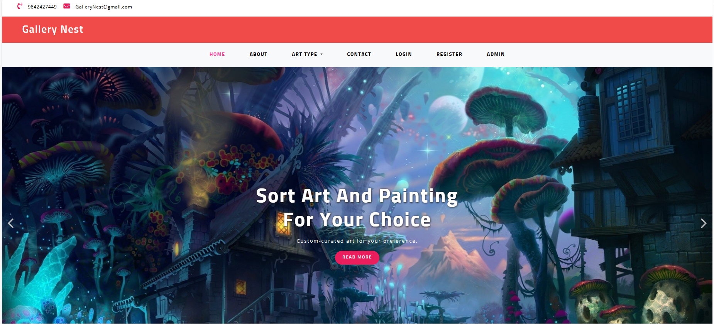

**Figure A.1: Artmandu homepage**

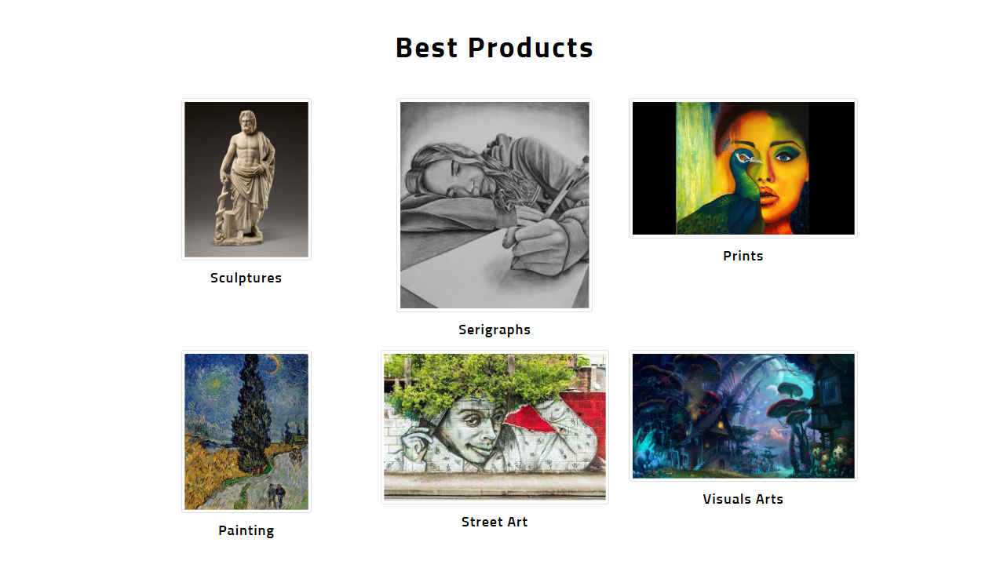

**Figure A.2: Best-products section**

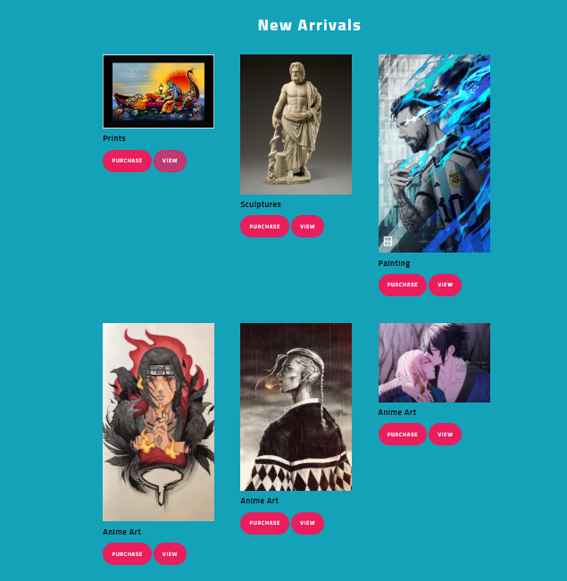

**Figure A.3: New-arrivals section**

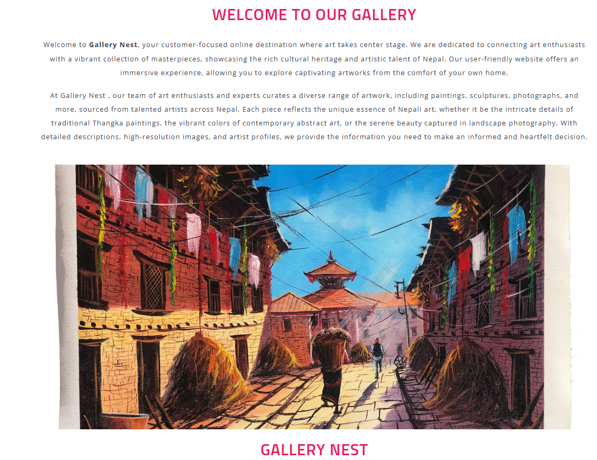

**Figure A.4: About-us page**

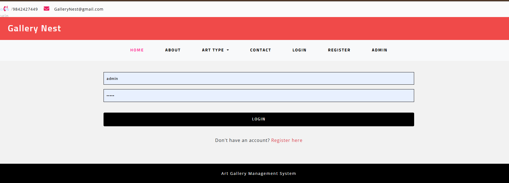

**Figure A.5: User login page**

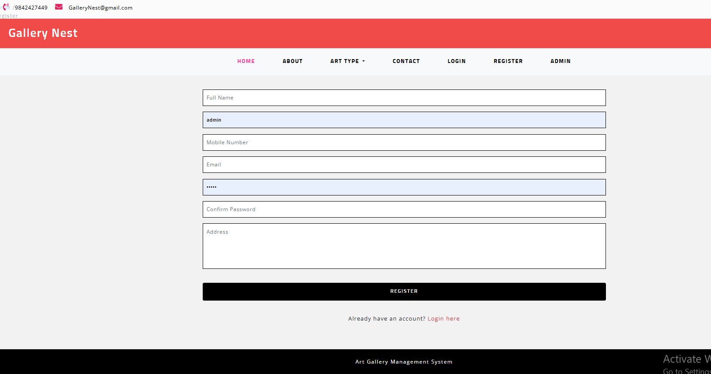

**Figure A.6: User registration page**

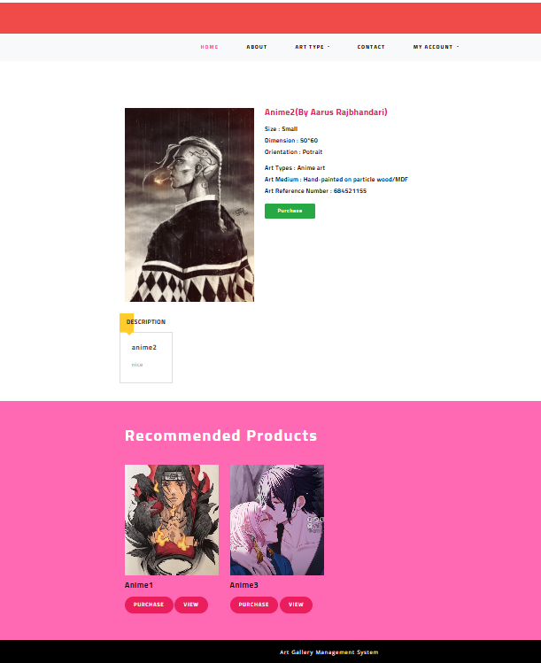

**Figure A.7: Related-artwork recommendations**

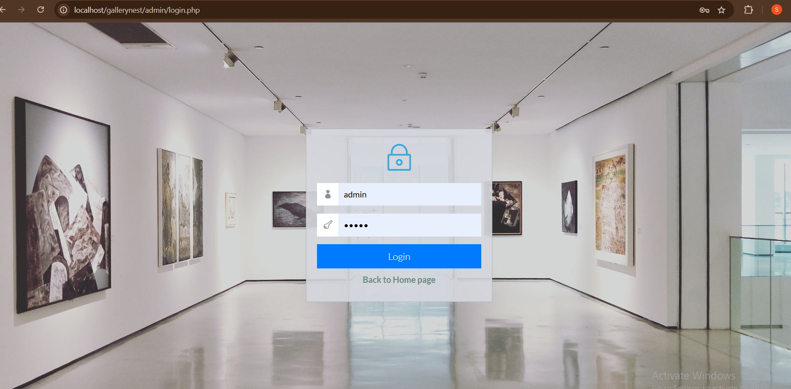

**Figure A.8: Administrator login page**

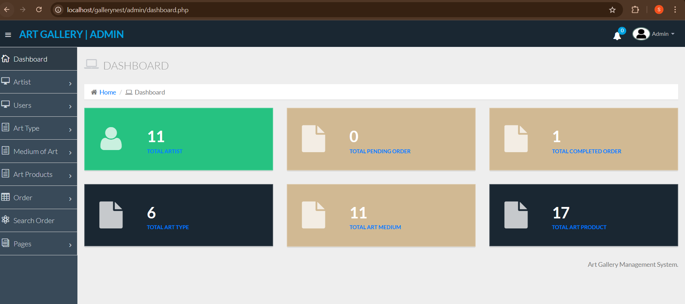

**Figure A.9: Administrator dashboard**

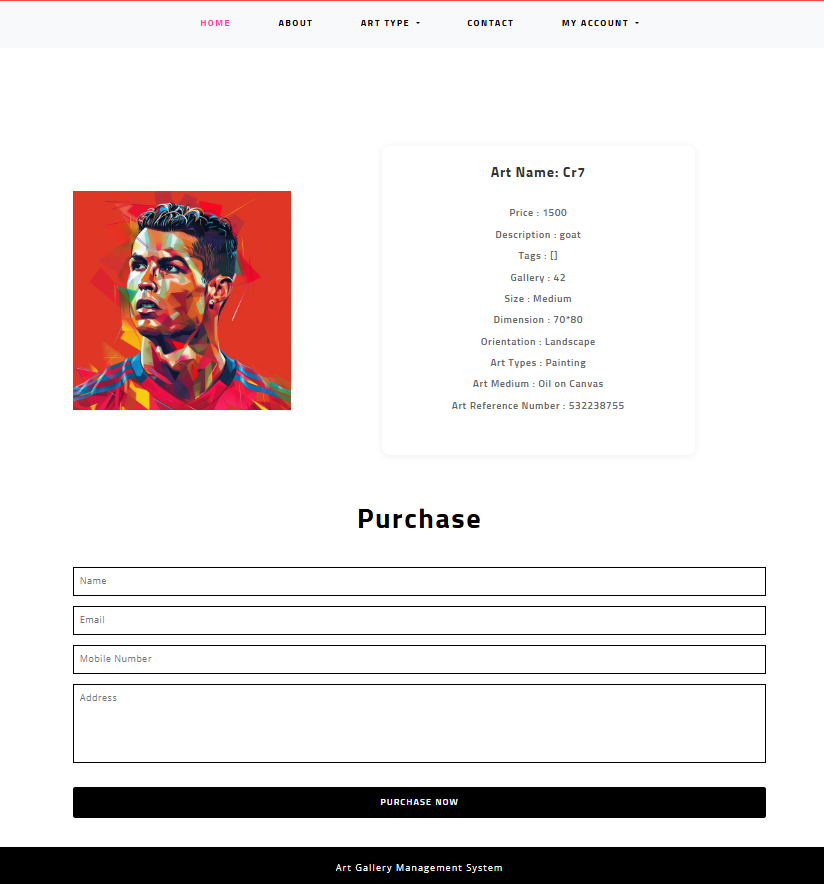

**Figure A.10: Purchase-artwork page**

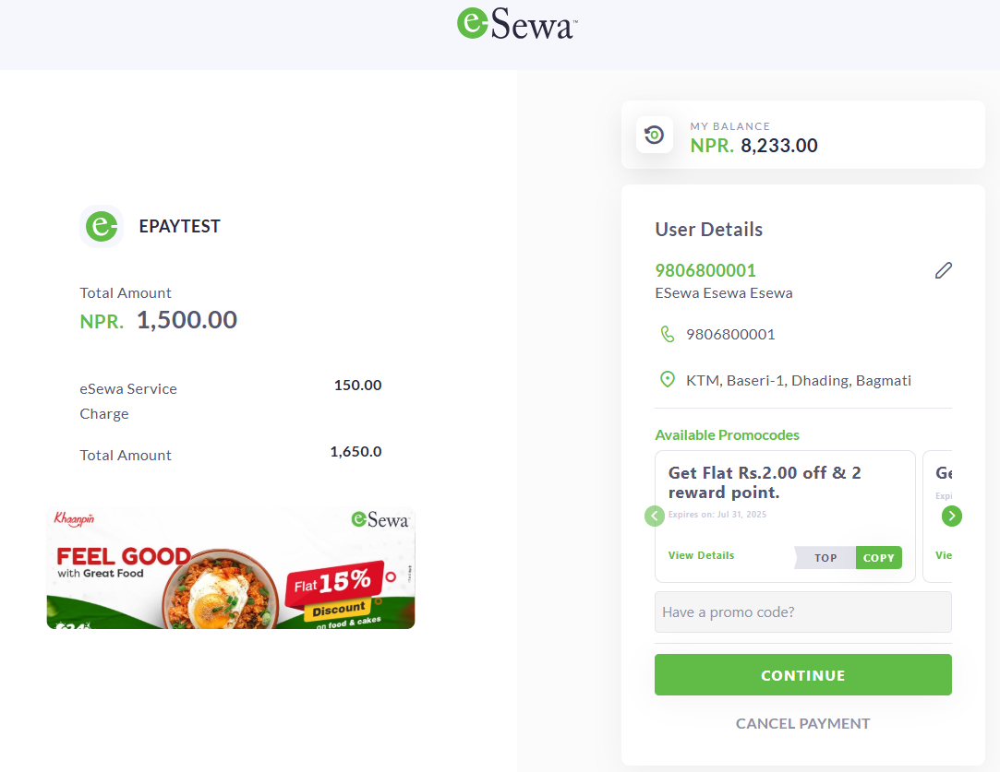

**Figure A.11: eSewa test payment page**

## Appendix B: Major Source-Code Components

### B.1 Password Creation and Verification

```php
$hashed_password = password_hash($password, PASSWORD_DEFAULT);

if (password_verify($password, $ret['Password'])) {
    $_SESSION['agmsuid'] = $ret['ID'];
    $_SESSION['agmsrole'] = $ret['Role'] ?? 'user';
}
```

This excerpt represents one-way password creation and authenticated session initialization. The complete validation and role routing remain in `register.php` and `login.php`.

### B.2 Recommendation Entry Point

```php
function getRecommendedProducts($con, $current_product_id, $limit = 4) {
    // Load the current item and candidates.
    // Calculate positive cosine matches.
    weightedSort($recommendedArray);
    return array_slice($recommendedArray, 0, $limit);
}
```

The function loads catalogue attributes, calls the similarity calculation for each other artwork, orders the positive matches, and returns a bounded result.

### B.3 AI-Detection API

```python
@app.post("/detect", response_model=DetectionResult)
async def detect(image: UploadFile = File(...)):
    contents = await image.read()
    result = detector.analyze(contents, image.filename)
    return DetectionResult(
        success=True,
        filename=image.filename,
        prediction=result["prediction"],
        signals=result["signals"],
        model=result["model"],
    )
```

The endpoint validates size and MIME type before inference; the shortened excerpt emphasizes its public input and output responsibility.

### B.4 eSewa Request Signature

```php
$message = "total_amount=" . $product_amount
    . ",transaction_uuid=" . $order_id
    . ",product_code=EPAYTEST";
$signature = base64_encode(
    hash_hmac('sha256', $message, $secret, true)
);
```

The generated value accompanies the ordered `signed_field_names` in the test payment form. Production deployment must keep the merchant secret outside source control.
